# 인천대학교 공지사항 서비스 - Database ERD

## 개요

인천대학교 공지사항 서비스의 데이터베이스 스키마 및 엔티티 관계도(ERD)입니다.

---

## ERD (Entity Relationship Diagram)

```mermaid
erDiagram
    %% ========================================
    %% 사용자 관련 테이블
    %% ========================================

    users {
        BIGSERIAL id PK "사용자 ID"
        VARCHAR(20) student_id UK "학번 (nullable)"
        VARCHAR(50) firebase_uid UK "Firebase UID (nullable)"
        VARCHAR(100) email UK "이메일"
        VARCHAR(255) password "암호화된 비밀번호"
        VARCHAR(50) name "이름"
        VARCHAR(255) fcm_token "FCM 푸시 토큰"
        VARCHAR(20) role "권한 (USER, ADMIN)"
        BOOLEAN is_active "활성 상태"
        BOOLEAN dark_mode "다크 모드 설정"
        BOOLEAN system_notification_enabled "시스템 알림 허용"
        BOOLEAN is_email_verified "이메일 인증 여부"
        TIMESTAMP created_at "생성 시각"
        TIMESTAMP updated_at "수정 시각"
    }

    %% ========================================
    %% 카테고리 관련 테이블
    %% ========================================

    categories {
        BIGSERIAL id PK "카테고리 ID"
        VARCHAR(50) code UK "카테고리 코드 (CS, ENG)"
        VARCHAR(100) name "카테고리 이름"
        VARCHAR(20) type "카테고리 유형 (DEPARTMENT, COLLEGE)"
        VARCHAR(255) url "크롤링 URL"
        BOOLEAN is_active "활성 상태"
        VARCHAR(500) description "설명"
        TIMESTAMP created_at "생성 시각"
        TIMESTAMP updated_at "수정 시각"
    }

    %% ========================================
    %% 공지사항 관련 테이블
    %% ========================================

    crawl_notice {
        BIGSERIAL id PK "공지사항 ID"
        BIGINT job_id FK "크롤링 작업 ID"
        TEXT url "원본 게시글 URL"
        VARCHAR(64) fingerprint "콘텐츠 지문 (중복 체크)"
        VARCHAR(32) snapshot_version "스냅샷 버전"
        VARCHAR(64) source "크롤링 소스"
        TEXT raw "원본 HTML"
        TEXT title "제목"
        TEXT content "내용"
        VARCHAR(100) external_id UK "외부 시스템 게시글 ID"
        VARCHAR(128) writer "작성자 (크롤러)"
        VARCHAR(100) author "작성자 (메인 서버)"
        VARCHAR(32) date "날짜 문자열"
        TIMESTAMP published_at "게시일"
        VARCHAR(32) hits "조회수 문자열"
        INTEGER view_count "조회수"
        VARCHAR(64) category "카테고리 문자열"
        BIGINT category_id FK "카테고리 ID"
        BOOLEAN is_important "중요 공지 여부"
        BOOLEAN is_pinned "상단 고정 여부"
        TEXT attachments "첨부파일 JSON"
        TIMESTAMP created_at "생성 시각"
        TIMESTAMP updated_at "수정 시각"
    }

    %% ========================================
    %% 북마크 및 검색 관련 테이블
    %% ========================================

    bookmarks {
        BIGSERIAL id PK "북마크 ID"
        BIGINT user_id FK "사용자 ID"
        BIGINT crawl_notice_id FK "공지사항 ID"
        VARCHAR(500) memo "사용자 메모"
        TIMESTAMP created_at "생성 시각"
        TIMESTAMP updated_at "수정 시각"
    }

    recent_searches {
        BIGSERIAL id PK "검색 ID"
        BIGINT user_id FK "사용자 ID"
        VARCHAR(100) keyword "검색 키워드"
        TIMESTAMP created_at "검색 시각"
        TIMESTAMP updated_at "수정 시각"
    }

    %% ========================================
    %% 알림 관련 테이블
    %% ========================================

    user_preferences {
        BIGSERIAL id PK "설정 ID"
        BIGINT user_id FK "사용자 ID"
        BIGINT category_id FK "카테고리 ID"
        BOOLEAN notification_enabled "알림 활성화"
        TIMESTAMP created_at "생성 시각"
        TIMESTAMP updated_at "수정 시각"
    }

    notification_history {
        BIGSERIAL id PK "알림 이력 ID"
        BIGINT user_id FK "사용자 ID"
        BIGINT crawl_notice_id FK "공지사항 ID"
        VARCHAR(200) title "알림 제목"
        VARCHAR(500) body "알림 내용"
        TIMESTAMP sent_at "전송 시각"
        VARCHAR(20) status "전송 상태 (SUCCESS, FAILED)"
        VARCHAR(500) error_message "에러 메시지"
    }

    %% ========================================
    %% 크롤러 관련 테이블 (FastAPI)
    %% ========================================

    crawl_job {
        SERIAL id PK "작업 ID"
        VARCHAR(128) name "작업 이름"
        VARCHAR(4) priority "우선순위 (P0-P3)"
        VARCHAR(64) schedule_cron "스케줄 Cron"
        VARCHAR(20) seed_type "시드 타입"
        JSON seed_payload "시드 페이로드"
        VARCHAR(20) render_mode "렌더 모드 (STATIC, HEADLESS)"
        FLOAT rate_limit_per_host "호스트당 속도 제한"
        INTEGER max_depth "최대 깊이"
        VARCHAR(20) robots_policy "Robots 정책"
        VARCHAR(20) status "작업 상태 (ACTIVE, PAUSED)"
        TIMESTAMP created_at "생성 시각"
        TIMESTAMP updated_at "수정 시각"
    }

    crawl_task {
        SERIAL id PK "태스크 ID"
        INTEGER job_id FK "작업 ID"
        TEXT url "크롤링 URL"
        VARCHAR(20) status "태스크 상태 (PENDING, RUNNING)"
        INTEGER retries "재시도 횟수"
        TEXT last_error "마지막 에러"
        TIMESTAMP started_at "시작 시각"
        TIMESTAMP finished_at "종료 시각"
        INTEGER http_status "HTTP 상태 코드"
        VARCHAR(64) content_hash "콘텐츠 해시"
        BOOLEAN blocked_flag "차단 플래그"
        INTEGER cost_ms_browser "브라우저 비용 (ms)"
        JSON attempt_strategy "재시도 전략"
    }

    host_budget {
        VARCHAR(128) host PK "호스트"
        FLOAT qps_limit "QPS 제한"
        INTEGER concurrency_limit "동시성 제한"
        INTEGER daily_budget_sec_browser "일일 예산 (초)"
        INTEGER used_today_sec "오늘 사용량 (초)"
    }

    webhook {
        SERIAL id PK "웹훅 ID"
        INTEGER job_id FK "작업 ID"
        TEXT target_url "대상 URL"
        VARCHAR(20) event "이벤트 (JOB_DONE, DOC_READY)"
        VARCHAR(128) secret "비밀 키"
    }

    %% ========================================
    %% 레거시 테이블 (삭제 예정)
    %% ========================================

    notices {
        BIGSERIAL id PK "공지사항 ID (레거시)"
        TEXT title "제목"
        TEXT content "내용"
        VARCHAR(100) author "작성자"
        TIMESTAMP published_at "게시일"
        INTEGER view_count "조회수"
        BIGINT category_id FK "카테고리 ID"
        BOOLEAN is_important "중요 공지"
        BOOLEAN is_pinned "상단 고정"
    }

    email_verification_tokens {
        BIGSERIAL id PK "토큰 ID (레거시)"
        BIGINT user_id FK "사용자 ID"
        VARCHAR(255) token UK "인증 토큰"
        TIMESTAMP expires_at "만료 시각"
        BOOLEAN is_used "사용 여부"
    }

    password_reset_tokens {
        BIGSERIAL id PK "토큰 ID (레거시)"
        BIGINT user_id FK "사용자 ID"
        VARCHAR(255) token UK "재설정 토큰"
        TIMESTAMP expires_at "만료 시각"
        BOOLEAN is_used "사용 여부"
    }

    %% ========================================
    %% 관계 정의
    %% ========================================

    %% 사용자 관련 관계
    users ||--o{ bookmarks : "has"
    users ||--o{ user_preferences : "has"
    users ||--o{ notification_history : "receives"
    users ||--o{ recent_searches : "searches"
    users ||--o{ email_verification_tokens : "has (레거시)"
    users ||--o{ password_reset_tokens : "has (레거시)"

    %% 카테고리 관련 관계
    categories ||--o{ user_preferences : "subscribed_by"
    categories ||--o{ notices : "contains (레거시)"

    %% 공지사항 관련 관계
    crawl_notice ||--o{ bookmarks : "bookmarked_by"
    crawl_notice ||--o{ notification_history : "notifies"
    crawl_job ||--o{ crawl_notice : "produces"

    %% 크롤러 관련 관계
    crawl_job ||--o{ crawl_task : "contains"
    crawl_job ||--o{ webhook : "triggers"
```



---

## 테이블 상세 설명

### 1. 사용자 관련 테이블

#### **users** (사용자)
- **설명**: 회원가입한 사용자 정보
- **주요 기능**:
  - Firebase Authentication 연동 (`firebase_uid`)
  - 학번 기반 인증 (`student_id`)
  - FCM 푸시 알림 지원 (`fcm_token`)
  - 다크 모드 및 알림 설정
- **인덱스**: email, student_id, firebase_uid

---

### 2. 카테고리 관련 테이블

#### **categories** (카테고리)
- **설명**: 공지사항 카테고리 (학과, 대학, 행정부서)
- **주요 기능**:
  - 카테고리 코드 기반 식별 (`code`)
  - 크롤링 URL 관리
  - 활성/비활성 상태 관리
- **예시**: 컴퓨터공학과(CS), 공과대학(ENG), 학사공지(ACADEMIC)

---

### 3. 공지사항 관련 테이블

#### **crawl_notice** (크롤링 공지사항)
- **설명**: 크롤러에서 수집한 공지사항 (메인 테이블)
- **주요 기능**:
  - 크롤링 메타데이터 관리 (job_id, fingerprint)
  - 공지사항 기본 정보 (제목, 내용, 작성자)
  - 사용자 기능 (중요 공지, 상단 고정, 북마크)
  - 첨부파일 지원 (JSON 형태)
- **인덱스**: job_id, url, category_id, published_at, external_id, fingerprint

#### **notices** (레거시 공지사항) ⚠️ **삭제 예정**
- **설명**: 레거시 공지사항 테이블
- **상태**: 더 이상 사용하지 않음. `crawl_notice`로 통합됨

---

### 4. 북마크 및 검색 관련 테이블

#### **bookmarks** (북마크)
- **설명**: 사용자가 저장한 공지사항
- **주요 기능**:
  - 사용자별 공지사항 북마크
  - 메모 기능 지원
- **제약 조건**: (user_id, crawl_notice_id) 유니크

#### **recent_searches** (최근 검색어)
- **설명**: 사용자별 최근 검색어 5개 저장
- **주요 기능**:
  - 검색어 자동완성
  - 검색 이력 관리
- **제약 조건**: (user_id, keyword) 유니크

---

### 5. 알림 관련 테이블

#### **user_preferences** (사용자 알림 설정)
- **설명**: 사용자가 구독한 카테고리
- **주요 기능**:
  - 카테고리별 푸시 알림 on/off
  - 새 공지사항 발생 시 알림
- **제약 조건**: (user_id, category_id) 유니크

#### **notification_history** (푸시 알림 이력)
- **설명**: 전송된 푸시 알림 기록
- **주요 기능**:
  - 알림 전송 성공/실패 추적
  - 에러 로깅
  - 알림 재전송 관리

---

### 6. 크롤러 관련 테이블 (FastAPI)

#### **crawl_job** (크롤링 작업)
- **설명**: 크롤링 작업 정의 및 스케줄 관리
- **주요 기능**:
  - Cron 기반 스케줄링
  - 우선순위 관리 (P0-P3)
  - 렌더 모드 설정 (정적/헤드리스 브라우저)
  - 속도 제한 설정

#### **crawl_task** (크롤링 태스크)
- **설명**: 개별 URL 크롤링 태스크
- **주요 기능**:
  - 태스크 상태 추적 (PENDING, RUNNING, SUCCESS)
  - 재시도 로직
  - HTTP 상태 코드 및 에러 로깅
  - 브라우저 비용 측정

#### **host_budget** (호스트 예산)
- **설명**: 호스트별 크롤링 예산 관리
- **주요 기능**:
  - QPS 제한
  - 동시성 제한
  - 일일 브라우저 사용 시간 제한

#### **webhook** (웹훅)
- **설명**: 크롤링 이벤트 웹훅 설정
- **주요 기능**:
  - 작업 완료 알림
  - 문서 준비 완료 알림
  - 에러 알림

---

### 7. 레거시 테이블 ⚠️ **삭제 예정**

#### **email_verification_tokens** (이메일 인증 토큰)
- **상태**: Firebase Authentication으로 대체됨
- **삭제 예정**: Phase 2

#### **password_reset_tokens** (비밀번호 재설정 토큰)
- **상태**: Firebase Authentication으로 대체됨
- **삭제 예정**: Phase 2

---

## 주요 관계

### 1:N 관계

```
users (1) ──────────── (N) bookmarks
users (1) ──────────── (N) user_preferences
users (1) ──────────── (N) notification_history
users (1) ──────────── (N) recent_searches

categories (1) ──────────── (N) user_preferences

crawl_notice (1) ──────────── (N) bookmarks
crawl_notice (1) ──────────── (N) notification_history

crawl_job (1) ──────────── (N) crawl_task
crawl_job (1) ──────────── (N) crawl_notice
crawl_job (1) ──────────── (N) webhook
```

---

## 인덱스 전략

### 성능 최적화를 위한 인덱스

1. **users**
   - idx_email (email)
   - idx_student_id (student_id)
   - idx_firebase_uid (firebase_uid)

2. **crawl_notice**
   - idx_job_id (job_id)
   - idx_url (url)
   - idx_category_id (category_id)
   - idx_published_at (published_at)
   - idx_external_id (external_id)
   - idx_fingerprint (fingerprint)
   - idx_is_important (is_important)
   - idx_is_pinned (is_pinned)

3. **bookmarks**
   - idx_user_id (user_id)
   - idx_crawl_notice_id (crawl_notice_id)

4. **user_preferences**
   - idx_user_pref_user_id (user_id)
   - idx_user_pref_category_id (category_id)

5. **notification_history**
   - idx_notif_user_id (user_id)
   - idx_notif_crawl_notice_id (crawl_notice_id)
   - idx_notif_sent_at (sent_at)

---

## 제약 조건 (Constraints)

### Unique Constraints

```sql
-- users
UNIQUE (email)
UNIQUE (student_id)
UNIQUE (firebase_uid)

-- categories
UNIQUE (code)

-- crawl_notice
UNIQUE (external_id)
UNIQUE (fingerprint)

-- bookmarks
UNIQUE (user_id, crawl_notice_id)

-- user_preferences
UNIQUE (user_id, category_id)

-- recent_searches
UNIQUE (user_id, keyword)
```

### Foreign Key Constraints

```sql
-- bookmarks
FK (user_id) REFERENCES users(id)
FK (crawl_notice_id) REFERENCES crawl_notice(id)

-- user_preferences
FK (user_id) REFERENCES users(id)
FK (category_id) REFERENCES categories(id)

-- notification_history
FK (user_id) REFERENCES users(id)
FK (crawl_notice_id) REFERENCES crawl_notice(id)

-- recent_searches
FK (user_id) REFERENCES users(id)

-- crawl_task
FK (job_id) REFERENCES crawl_job(id)

-- crawl_notice
FK (job_id) REFERENCES crawl_job(id)

-- webhook
FK (job_id) REFERENCES crawl_job(id)
```

---

## 데이터베이스 통계

### 현재 테이블 현황 (2025-11-27 기준)

| 테이블 | 행 수 | 상태 | 용도 |
|--------|-------|------|------|
| users | 30 | ✅ Active | 사용자 관리 |
| categories | 0 | ✅ Active | 카테고리 관리 |
| crawl_notice | 0 | ✅ Active | 공지사항 메인 |
| bookmarks | 0 | ✅ Active | 북마크 기능 |
| user_preferences | 0 | ✅ Active | 알림 설정 |
| notification_history | 0 | ✅ Active | 알림 이력 |
| recent_searches | 0 | ✅ Active | 검색 기록 |
| crawl_job | 0 | ✅ Active | 크롤링 작업 |
| crawl_task | 0 | ✅ Active | 크롤링 태스크 |
| host_budget | 0 | ✅ Active | 호스트 예산 |
| webhook | 0 | ✅ Active | 웹훅 |
| notices | 0 | ⚠️ Legacy | 레거시 (삭제 예정) |
| email_verification_tokens | 0 | ⚠️ Legacy | 레거시 (삭제 예정) |
| password_reset_tokens | 0 | ⚠️ Legacy | 레거시 (삭제 예정) |

---

## 데이터베이스 접속 정보

```yaml
Host: localhost (Docker: postgres)
Port: 5432
Database: incheon_notice
Username: postgres
Password: postgres
```

### pgAdmin 접속

```
URL: http://localhost:5050
Email: admin@admin.com
Password: admin
```

---

## 마이그레이션 이력

### 2025-11-25: Firebase Authentication 통합
- `users` 테이블에 `firebase_uid` 컬럼 추가
- `student_id` nullable로 변경
- Firebase UID 마이그레이션 실행

### 2025-11-25: 레거시 테이블 삭제 예정
- `notices` → `crawl_notice`로 통합
- `email_verification_tokens` → Firebase로 대체
- `password_reset_tokens` → Firebase로 대체

---

## 참고 자료

- Spring Boot Entity: `src/main/java/com/incheon/notice/entity/`
- FastAPI Models: `crawling-server/app/models.py`
- Database Guide: `PGADMIN_GUIDE.md`
- Firebase Guide: `FIREBASE_EMAIL_VERIFICATION_GUIDE.md`
